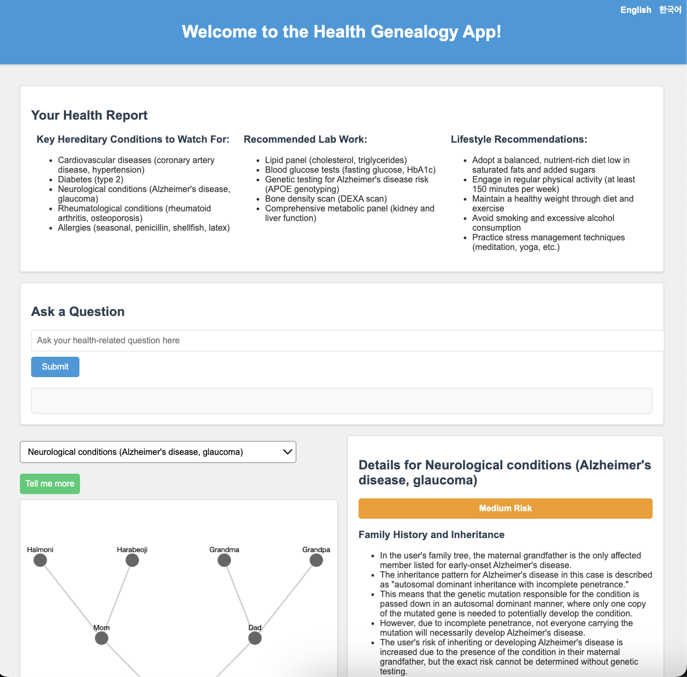

# Welcome to the Health Genealogy App!

This application was developed by Team Pothos during the Out Of Pocket Gen AI x Healthcare Ops Hackathon hosted in San Francisco over June 21-23, 2024.

Team Pothos (in alphabetical order):

[Samir Chowdhury](https://www.linkedin.com/in/samirchowdhury01/)
[Daniel Kotin](https://www.linkedin.com/in/daniel-kotin/)
[Jinny Yoo](https://www.linkedin.com/in/jinny-yoo/)

# Usage with Docker

Simply run `make dev` in the `pothos` folder. This will drop you into a terminal with the necessary packages and libraries.

# Adding secrets

Create an `anthro_api_key.txt` file and paste your Anthropic API key. The `entrypoint.sh` file will automatically export this as an `ANTHROPIC_API_KEY` environment variable.